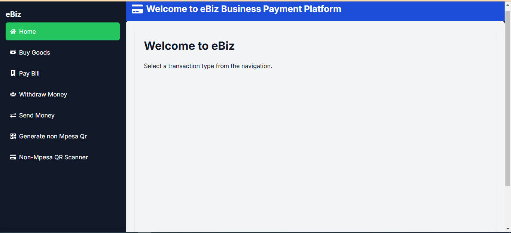
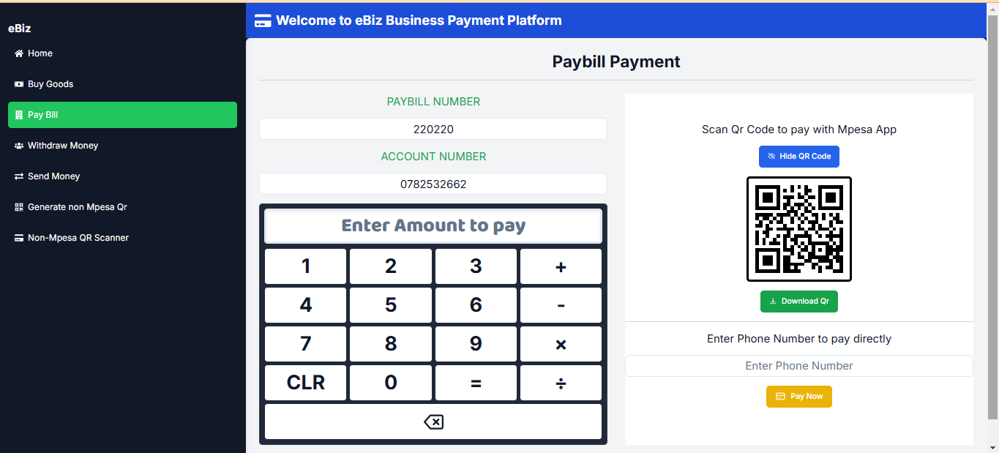

<div align="center">

<h1>PESAQR</h1>
</div>

This is a Business MPESA Payment app thet is meant to: 
- Generate M-PESA Payment QR Codes for any Till, Paybill, Send Money and Withraw cash.
- Allow for push STK payments
- Generate non-MPESA Qr code generation for internal payment
- Allow for push STK Payments through non-MPESA Qr codes generated internally

I improved this app from the initial repo by David Munga (https://github.com/DavidAmunga/pesaqr). Currently the [M-PESA app](https://play.google.com/store/apps/details?id=com.safaricom.mpesa.lifestyle&hl=en) is the most used finance app in the Android/iOS appstores.

The 'Scan QR to Pay' feature exists but isn't widely used. While shopping in a supermarket it is faster than keying in the store details or waiting for a payment prompt from the teller.

---

## Run Locally

Clone the project

```bash
  git clone https://github.com/omondisteven/eBiz_mpesa_payment_app.git
```

Go to the project directory

```bash
  cd ebiz_payment
```

Install dependencies

```bash
  npm install
```

Start the project

```bash
  npm run dev
```

## Tech Stack

React,TailwindCSS

## Screenshots




## Roadmap

- Better Responsiveness on Android Tablets - Done
- Add Withdraw Cash QR - Done
- Add Deploy to own hosting platform

## Lessons Learned

1. Proper Install Prompts is critical for adoption of PWA's
2. Offline-Only apps have their limitations but can be made better if their value is optimized. (No Self Hosted headaches)

## Demo

→ [eBiz hosted on vercel.com](https://e-biz-mpesa-payment-app.vercel.app/)

## License

[MIT](https://choosealicense.com/licenses/mit/)


## Feedback

If you have any feedback, please shoot a [DM me](https://web.facebook.com/steve.omondi.587) directly via X
